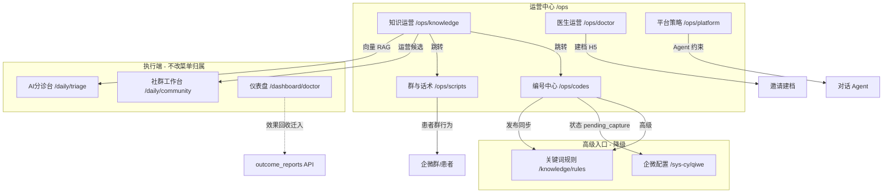

# 运营中心大改 · 信息架构与分期设计

**日期：** 2026-07-22  
**状态：** 一期已实施（2026-07-22）；二期见 §4  
**范围：** `admin-ui` 运营中心菜单与页面重组；后端 API **不变**（复用 config-center / ops-strategy / group-codes）

---

## 1. 背景与目标

原运营中心 3 页（运营策略 / 运营配置 / 编号总览）职责重叠、认知负担高：

- 「编号」分散在 3 个入口（运营配置、编号总览、关键词规则）
- 「运营策略」混合了**不驱动系统的策略文档**与**驱动 RAG 的知识库**
- 「运营配置」6 个域挤在一页，日常运营与平台超管配置混杂

**目标：** 按运营人员真实工作流重组为 4+1 模块，旧路由兼容跳转。

---

## 2. 新信息架构（菜单）

```
运营中心 /ops  →  默认进入「群与话术」
├── 群与话术      /ops/scripts      原 config.scripts
├── 编号中心      /ops/codes        原 group-codes + config.codes_cards（Tab）
├── 知识运营      /ops/knowledge    原 ops 页知识库部分（去策略/效果回收）
├── 医生运营      /ops/doctor       原 config.doctor_group + contact_form
└── 平台策略      /ops/platform     原 config.prompts + safety（仅超管可见）
```

### 2.1 页面关系图



### 2.2 旧路由兼容

| 旧路径 | 新路径 |
|--------|--------|
| `/ops/strategy` | `/ops/knowledge` |
| `/ops/config` | `/ops/scripts` |
| `/ops/group-codes` | `/ops/codes` |

---

## 3. 模块说明

### 3.1 群与话术（核心 · 一期）

- **数据源：** `config-center` domain `scripts`
- **用户：** 日常医助/运营
- **内容：** 欢迎语、编号话术正文、转人工、急症、语音图片兜底等
- **发布：** draft → preview → publish（保持现有流程）

### 3.2 编号中心（核心 · 一期）

- **Tab A 状态总览：** 原 `GET /api/admin/group-codes`（只读）
- **Tab B 编号配置：** 原 `codes_cards` 配置域
- **外链：** 「高级规则」→ `/knowledge/rules`；企微卡未就绪 → `/sys-cy/qiwe`

### 3.3 知识运营（核心 · 一期）

- **保留：** 四层知识库 CRUD、补齐模板、重建向量、生成社群候选
- **移除 UI：** 商业策略六宫格、效果回收表单/图表、策略编辑弹窗
- **API：** 仍用 `ops-strategy`（读 summary/configLink）+ knowledge/outcomes API（outcomes 不再在本页展示）

### 3.4 医生运营（核心 · 一期）

- **数据源：** `doctor_group` + `contact_form`
- **内容：** 医生简介、社群列表、新群默认、建档表单选项

### 3.5 平台策略（超管 · 一期隐藏菜单）

- **数据源：** `prompts` + `safety`
- **可见性：** `roles: ['R_SUPER']` 或 capabilities 扩展
- **从日常运营配置中剥离**

---

## 4. 分期优先级

### 一期做（本次）

| 项 | 动作 |
|----|------|
| 群与话术 | 独立路由 + config 单域模式 |
| 编号中心 | 总览 + 配置 Tab 合并 |
| 知识运营 | 从运营策略页剥离 |
| 医生运营 | 双域 config 页 |
| 平台策略 | 超管子菜单 |
| 路由兼容 | 旧 URL redirect |
| 文案/跳转 | 全站「运营配置」链接更新 |

### 二期做

| 项 | 动作 |
|----|------|
| 效果回收 | 迁入「仪表盘 → 医生数据」专区 |
| 关键词规则 | 编号中心内嵌「高级模式」抽屉，减少跳转 |
| 运营健康度 | 统一看板（规则启用率、向量状态、待采集卡） |
| capabilities | `OpsGroupCodes` 等 tab 键与新路由对齐 |
| config 组件拆分 | `ConfigCenterPanel.vue` 独立复用 |

### 直接砍（UI 层）

| 项 | 理由 |
|----|------|
| 商业策略六宫格 | `ops_strategy` 文本不参与运行时 |
| 运营策略页「工作流清单」冗长版 | 合并为知识页顶部简短提示 |
| 运营配置 6 域平铺 Tab | 拆到各子菜单 |
| 旧版 admin-legacy 运营页 | 已废弃，不维护 |

**保留 DB/API：** `ops_strategy`、`outcome_reports` 表不删；二期仪表盘可读 outcomes。

---

## 5. 权限与可见性

| 路由 | capabilities.tabs | 备注 |
|------|-------------------|------|
| OpsScripts | `config` | 沿用 |
| OpsKnowledge | `ops` | 沿用 |
| OpsCodes | （无） | 与 scripts 同权，后续可增 `codes` |
| OpsDoctor | `config` | 沿用 |
| OpsPlatform | super only | 不走 tabs |

---

## 6. 成功标准

1. 运营人员可在「群与话术」完成 80% 日常改稿，无需进入 6 域大页
2. 「编号中心」一眼看清状态并可切 Tab 编辑
3. 「知识运营」无策略文档干扰，向量/候选流程保留
4. 旧书签 `/ops/config` 等自动跳转，无 404
5. `npm run build` 通过

---

## 7. 非目标

- 不改 `config-center` 后端协议
- 不重写关键词规则引擎
- 不做新版视觉稿（仅 IA + 页面拆分）
