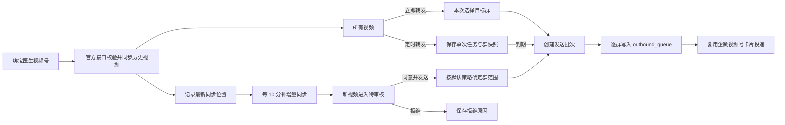

# 视频号账号管理与群转发设计规格

## 1. 目标

在运营中心新增“视频号运营”，将医生视频号绑定、历史视频同步、新视频审核、立即转发和单次定时转发纳入现有患者群运营闭环。

成功标准：

- 运营人员绑定医生视频号后，可以查看官方接口可读取的全部历史与新增视频。
- 首次同步的历史视频只进入“所有视频”，不产生待审核任务。
- 绑定后的新视频自动进入待审核队列，运营点击“同意并发送”后才可发送。
- 账号策略支持发送到医生全部启用患者群，或固定的指定患者群。
- “所有视频”支持临时选择群并立即转发，或创建单次定时转发。
- 每个目标群均复用现有 `outbound_queue` 与企微视频号卡片投递链路。
- 同步、审批、定时执行和失败重试均保持幂等，不产生重复发送。

## 2. 范围

### 2.1 本期包含

- 一个医生绑定一个当前视频号。
- 扫码绑定和账号信息绑定两个入口。
- 微信官方接口账号校验、历史视频分页同步和新视频增量同步。
- 账号默认群范围设置。
- 所有视频、待审核、任务队列页面；定时任务在任务队列中管理。
- 立即转发、审核后立即转发、单次定时转发。
- 逐群结果、失败原因和单群重试。
- 操作权限和审计信息。

### 2.2 本期不包含

- 一名医生同时运营多个有效视频号。
- 关键词过滤、内容自动判优或 AI 自动审核。
- 周期性重复发送同一视频。
- 未经逐条审核的新视频自动发送。
- 多家视频数据服务商切换框架。
- 视频下载、转码、二次剪辑或重新发布到视频号。

## 3. 平台能力前提

运营界面不展示“已授权/未授权”差异。无论使用扫码还是账号信息入口，只有系统通过微信官方能力解析出唯一账号、成功读取账号资料并具备读取视频列表的能力后，才返回“绑定成功”。只保存名称但不能读取视频的记录不属于有效绑定。

第一期只实现微信官方数据适配。若申请到的官方权限不能读取指定账号的视频列表，则自动同步能力无法通过更换页面或调度逻辑补足，需先获得对应官方权限；系统不得用不稳定的页面抓取静默替代。

“所有视频”表示官方接口实际可读取的全部历史记录，并持续积累后续新增视频。

## 4. 信息架构

运营中心新增一级功能“视频号运营”，内部包含四个页签：

1. 账号管理
2. 所有视频
3. 待审核
4. 任务队列

三个业务页分别采用已确认的三张原型，不合并为同一张折中页面：

- “待审核”采用审核工作台原型：左侧待审核视频，右侧完成视频预览、群范围确认、同意并发送或拒绝。
- “所有视频”采用视频内容库原型：以封面网格、筛选和详情侧栏为主，支持立即转发和单次定时转发。
- “任务队列”采用运营任务队列原型：统一汇总待审核、待执行、发送失败及失败群重试；定时任务作为其中一种任务类型，不再单独建设“定时任务”页。
- “账号管理”沿用现有后台表单与列表风格，负责绑定、同步、暂停/换绑和默认群策略。

## 5. 数据设计

### 5.1 `video_channel_accounts`

- `id`
- `doctor_id`：当前有效绑定唯一。
- `platform_account_id`：微信侧唯一账号标识。
- `account_name`
- `avatar_url`
- `bind_method`：`qr` 或 `account_info`。
- `enabled`
- `group_scope`：`all` 或 `selected`。
- `group_ids`：指定群 ID 数组；`all` 时保存空数组。
- `sync_cursor`
- `initial_sync_completed_at`
- `last_synced_at`
- `last_sync_error`
- `created_by`、`updated_by`
- `created_at`、`updated_at`

换绑时旧账号改为非当前状态并保留数据。解绑不删除历史视频和发送记录。

### 5.2 `video_channel_videos`

- `id`
- `account_id`
- `doctor_id`
- `platform_video_id`
- `title`
- `description`
- `cover_url`
- `published_at`
- `feed_video_payload`：现有企微投递所需完整视频号卡片字段。
- `discovery_kind`：`initial` 或 `incremental`。
- `review_status`：`not_required`、`pending`、`approved`、`rejected`、`incomplete`。
- `reviewed_by`、`reviewed_at`、`review_note`
- `created_at`、`updated_at`

唯一约束为 `(account_id, platform_video_id)`，阻止重复同步。

### 5.3 `video_channel_schedules`

- `id`
- `video_id`
- `doctor_id`
- `execute_at`：以 ISO 时间保存，界面按北京时间录入和展示。
- `group_scope_snapshot`
- `group_ids_snapshot`
- `status`：`pending`、`running`、`completed`、`cancelled`、`failed`。
- `fire_key`：执行幂等键。
- `last_attempt_at`
- `last_error`
- `created_by`、`executed_by`
- `created_at`、`updated_at`

不新增独立发送明细表。每个目标群的发送结果继续由现有 `outbound_queue` 记录，payload 中保存 `videoId`、`scheduleId` 或 `reviewBatchKey`。

## 6. 业务规则

### 6.1 绑定与同步

- 扫码绑定和账号信息绑定最终调用同一服务端校验入口。
- 未成功读取账号资料与至少一页视频结果时，不落有效绑定。
- 首次同步分页写入历史视频，标记为 `initial/not_required`。
- 首次同步完成后才保存增量游标；此后的新视频标记为 `incremental/pending`。
- 固定每 10 分钟同步一次，并提供手动同步。
- 同步失败保留现有数据和游标，下次继续重试；不把失败误判为“没有新视频”。

### 6.2 群范围

- `all`：执行时选择该医生名下所有启用患者群。
- `selected`：保存前验证所有群均属于该医生且已启用。
- 审核同意使用账号当前默认策略。
- 所有视频中的立即转发和定时转发默认带入账号策略，但允许本次临时修改。
- 定时任务保存群范围快照，后续账号策略变化不改变已创建任务。
- 真正发送前再次验证医生与群归属；已停用或已转移的群跳过并记录失败原因。

### 6.3 审核与发送

- 只有增量新视频自动进入待审核。
- “同意并发送”弹出二次确认并显示目标群数量。
- 同意操作生成唯一批次键；重复点击返回原结果，不重复写发送队列。
- 拒绝必须填写原因，拒绝后不产生发送任务。
- 视频号卡片字段不完整时状态为 `incomplete`，禁止审核和发送。
- 每个目标群独立写入一条 `outbound_queue`，状态初始为 `pending`，再复用现有确认发送/真实投递能力。
- 单群失败不影响其他群，失败群可单独重试。

“同意并发送”中的“发送”沿用现有出站安全边界：审批动作生成并推进该批群发送，但最终消息投递仍受现有出站权限、群状态和企微配置校验控制。

### 6.4 单次定时

- 运营从所有视频选择视频、北京时间和群范围。
- 仅允许创建未来时间的单次任务。
- 调度器每分钟检查到期任务，并补执行服务重启期间错过的任务。
- `fire_key` 与状态条件更新共同保证一个任务只生成一个发送批次。
- 待执行任务允许取消；失败任务允许人工重试。
- 成功后状态改为 `completed`，不重复执行。

## 7. 页面设计

### 7.1 账号管理

展示医生、视频号头像与名称、视频数、最近同步时间和同步状态。支持绑定、立即同步、暂停、换绑、解绑及默认群策略设置。

账号信息绑定时先查询候选账号，运营确认唯一账号后再保存，避免同名误绑。

### 7.2 所有视频

按医生、账号、发布时间和状态筛选。卡片展示封面、标题、发布时间、来源账号、审核状态和累计发送次数。操作包括预览、立即转发、定时转发。

转发弹窗展示默认群范围，并允许切换全部群或勾选特定群。立即转发需要二次确认。

### 7.3 待审核

仅展示 `pending` 新视频。详情展示视频信息、默认策略、预计目标群和数据完整性。操作为“同意并发送”或“拒绝”。处理后展示逐群结果，失败群提供重试入口。

菜单显示待审核数量徽标。

### 7.4 任务队列

按“待审核、待执行、发送失败”分组展示任务，并提供统一的主从工作区。任务详情展示视频、北京时间、目标群数量、状态、执行人、失败原因和逐群结果。待审核任务可同意或拒绝，待执行任务可取消，失败任务可只重试失败群，已完成任务可查看发送明细。

“任务队列”是对既有审核、定时和出站记录的聚合视图，不新增第四张通用任务表，也不复制发送状态。

## 8. 权限

本期复用现有权限能力，避免新增动作未进入角色表而导致非超级管理员全部被拒绝：

- `dashboard.doctor.read`：查看账号、视频和任务记录。
- `ops.strategy.manage`：绑定、换绑、解绑、同步及修改策略。
- `community.outbox.send`：审核、拒绝、立即转发、创建/取消/重试定时任务及最终发送。

所有服务端接口独立校验医生范围和动作权限，不能依赖前端隐藏按钮。

## 9. 异常与审计

- 官方接口限流或失败：记录账号错误，保留游标并退回下一周期重试。
- 连续同步失败：账号显示异常，不删除绑定。
- 数据缺字段：视频标记 `incomplete`，禁止发送。
- 群归属或状态变化：逐群跳过并记录原因。
- 投递失败：沿用 `outbound_queue` 的失败状态、错误和重试次数。
- 绑定、换绑、策略修改、审核、拒绝、定时、取消和重试均记录操作人及时间。

## 10. 测试与验收

- 首次同步历史视频均为 `not_required`，不会产生待审核或发送记录。
- 增量同步的新视频均为 `pending`。
- 重复同步相同平台视频 ID 不重复入库。
- 同意操作重复提交不重复创建发送批次。
- 全部群和指定群均严格限制在当前医生名下启用群。
- 立即转发、审核发送、定时转发均产生正确的视频号卡片 payload。
- 无相应权限的接口调用被拒绝。
- 定时任务到期执行、重启补偿和重复 tick 不产生重复发送。
- 一个群投递失败不改变其他群的成功结果，并可只重试失败群。
- 解绑或换绑不删除历史记录。
- 官方接口异常时不移动同步游标，不丢失后续新视频。

## 11. 开发前置条件

实施官方同步适配器前，需要取得微信官方接口文档、应用身份、测试账号和相应的视频号账号/作品读取权限。其余账号管理、视频库、审核、群策略、任务队列、定时执行和发送复用部分可以先按本规格开发并使用接口桩验证。
