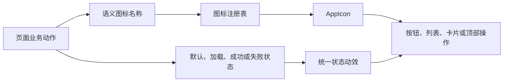

# 患者端小程序图标与动效升级需求设计

- 文档状态：设计已确认
- 日期：2026-08-05
- 适用项目：`patient-uniapp`
- 业务重点：提升服务包展示、开通与交付链路的识别效率

## 1. 背景

患者端小程序正在承接医生群患者、健康档案、在线咨询、健康计划和术后服务包。随着康复指导、术后评估、问诊组合、实物商品和服务权益逐步落地，现有图标与交互反馈已不足以支撑统一、可信的医疗服务体验。

本次盘点发现：

- 图标目录共有 54 个文件，约 667.8KB，实际仅有 43 个不同位图。
- 20 个文件构成 9 组完全重复资源。
- 页面和组件中共有 87 个静态交互模板；运行时循环可能产生多个实例。
- 共有 29 个 `AppButton`、8 个原生 `button`，大量按钮尚未配置图标。
- 现有图标混用蓝色细线、绿色线面和厚描边轻立体三种语言。
- “问用药”和“直接咨询”等不同动作共用同一图标；安全、退出、解绑等风险等级不同的动作也存在误复用。
- `view-archive-btn.png` 将文字和按钮整体栅格化，单个资源约 69.5KB。
- 全局动效主要只有透明度按压反馈，缺少加载、成功、失败和防重复提交的统一反馈。

## 2. 目标与成功标准

### 2.1 目标

1. 建立覆盖全部可点击控件的统一语义图标系统。
2. 用克制、明确的状态动效反馈操作过程和结果。
3. 优先提升服务包展示、开通和交付链路的可理解性。
4. 在不修改业务接口的前提下，通过公共组件完成可持续迁移。
5. 减少重复资源和主包体积，降低后续维护成本。

### 2.2 “每个 button”的范围定义

本需求中的 button 指所有可执行操作的控件，包括：

- 矩形、胶囊和文字按钮；
- 独立图标按钮；
- 可点击列表行；
- 整体可点击卡片；
- 顶部导航操作；
- 底部导航项；
- 加载失败、空状态和结果状态中的操作入口。

每个不同动作必须有准确的语义图标；相同动作在不同页面复用同一图标。不得为了“每个按钮不同”而为相同动作创建不同图形。

### 2.3 非目标

- 不调整服务包定价、商品货源或权益规则。
- 不修改后端接口、支付流程和健康档案数据结构。
- 不进行与图标、按钮状态和微交互无关的页面重构。
- 不增加页面入场编排、粒子特效或娱乐化庆祝动画。

## 3. 已确认的设计决策

### 3.1 图标风格

采用“纯线性”方向：

- 基础画布为 24×24；
- 统一约 1.8px 圆角描边；
- 使用圆角端点和转角；
- 不使用渐变、投影、高光、拟物底座；
- 图标内部留白和视觉重心保持一致；
- 老年模式只放大图标和点击区域，不额外加粗描边。

### 3.2 动效强度

采用“状态引导”方向：

- 提供按下、处理中、成功、失败和禁用状态；
- 上传、发送、前进、返回、刷新等图标按语义产生小幅运动；
- 结果使用淡入或轻微上浮表达；
- 不使用弹跳、弹簧、装饰性循环和页面元素依次飞入。

### 3.3 替换策略

采用“语义系统化重构”：先建立完整语义表和公共组件规则，再分批迁移页面。设计一次统一，开发按优先级实施。

## 4. 可替换内容

| 区域 | 需要替换的内容 | 推荐语义 |
| --- | --- | --- |
| 全局导航 | 返回、首页、咨询、我的、更多、关闭 | `nav-back`、`nav-home`、`nav-consult`、`nav-profile`、`action-more`、`action-close` |
| 首页快捷入口 | 上传档案、问用药、记录指标、术后随访、服务包、直接咨询 | `upload-record`、`medication`、`metric-record`、`follow-up`、`service-package`、`consult-doctor` |
| 首页操作 | 完善资料、手动创建、重新加载、提醒操作 | `profile-edit`、`action-create`、`action-refresh`、`reminder` |
| 医生群 | 进入医生群、邀请患者、群服务说明 | `doctor-group`、`invite-patient`、`group-service` |
| 咨询 | 清空、快捷问题、重试、发送、进入咨询 | `action-clear`、`quick-question`、`action-refresh`、`action-send`、`consult-doctor` |
| 健康档案 | 绑定、创建计划、完善档案、确认项目、查看记录、更新档案 | `record-bind`、`plan-create`、`record-edit`、`action-confirm`、`health-record`、`action-update` |
| 健康计划 | 下一任务、查看计划、用药管理、咨询当前计划 | `task-next`、`health-plan`、`medication`、`plan-consult` |
| 服务包 | 查看详情、开通、康复指导、术后评估、问诊、商品订单、权益 | `service-detail`、`service-activate`、`rehab-guide`、`postop-assessment`、`consult-doctor`、`goods-order`、`service-rights` |
| 家庭成员 | 添加成员、进入档案、授权范围 | `member-add`、`member-record`、`permission-scope` |
| 登录授权 | 微信登录、绑定手机号、验证码、确认绑定 | `wechat`、`phone-bind`、`verification-code`、`action-confirm` |
| 我的与设置 | 订单、服务、隐私、安全、导出、删除、退出、解绑 | `order`、`service-center`、`privacy`、`account-security`、`data-export`、`data-delete`、`account-logout`、`wechat-unbind` |
| 状态操作 | 加载、成功、失败、警告、空状态 | `status-loading`、`status-success`、`status-error`、`status-warning`、`status-empty` |

必须纠正以下现有冲突：

1. “问用药”和“直接咨询”不得继续共用 `quick-med`。
2. 账号安全、退出登录和解除微信绑定不得继续共用锁形图标。
3. 数据导出和申请删除数据不得共用同一个数据图标。
4. 提醒设置和助手上下文共享必须拆分语义。
5. 服务包、服务中心和助手角色不得全部使用盾牌。
6. “查看档案”文字图片必须替换为真实图标和文本按钮。
7. 返回字符 `‹` 必须替换为统一返回图标。
8. `help` 不得继续兼任帮助、错误、重试和警告。

## 5. 图标系统规范

### 5.1 尺寸

| 场景 | 显示尺寸 |
| --- | ---: |
| 小型文字操作、验证码 | 16px |
| 普通按钮、列表入口 | 20px |
| 顶部图标按钮、底部导航 | 24px |
| 首页快捷入口 | 28–32px |
| 成功、失败和空状态 | 40–48px |

独立图标按钮的可点击区域不得小于 44×44px。

### 5.2 颜色

- 主操作使用现有品牌绿色变量；
- 深色按钮内图标使用白色；
- 次要和禁用状态使用中性灰；
- 删除、解绑和退出等危险操作使用危险色；
- 成功、警告和失败使用统一状态色；
- 页面不得为单个图标随意硬编码新颜色。

### 5.3 命名

图标按业务动作命名，不按页面位置命名。禁止新增 `asset-*`、`quick-*` 等仅描述位置的名称。导航、动作、状态和业务领域通过语义前缀区分。

### 5.4 资产格式

- 设计源文件保存为 SVG；
- 小程序运行时继续使用本地高清 PNG，避免一次性改变现有资源链路；
- 只生成实际使用的主色、白色、灰色和危险色版本；
- 输出前执行无损压缩；
- 所有页面必须通过 `AppIcon` 获取图标，不得直接拼接静态路径。

## 6. 组件架构

### 6.1 图标注册表

建立集中式语义注册表，记录：

- 语义名称；
- 默认资源；
- 必要的状态色资源；
- 默认动效类型；
- 旧名称兼容别名。

页面只提交语义名称，不关心文件路径。

### 6.2 公共组件职责

- `AppIcon`：根据语义名称、尺寸、颜色状态和交互状态解析资源。
- `AppButton`：统一文本按钮的图标位置、加载态、成功态、失败态和防重复提交。
- `AppIconButton`：承载返回、关闭、更多等独立图标操作，并强制提供无障碍说明。
- `AppListRow`：左侧显示业务语义图标，右侧统一显示方向箭头。
- 可点击卡片：只显示一个主语义图标和一个方向指示，不在卡片内部重复堆叠图标。

### 6.3 数据与交互流



页面继续执行原有业务事件；组件只负责展示状态、锁定重复点击和播放反馈，不改变业务数据流。

## 7. 动效规范

### 7.1 状态链路

```text
默认 → 按下 → 处理中 → 成功/失败 → 恢复或跳转
```

- 按下：缩放至约 0.98，持续 120–140ms；
- 处理中：显示统一加载图标并禁止重复点击；
- 成功：勾选图标淡入或轻微上浮，持续 200–220ms；
- 失败：错误图标和错误文字淡入，不剧烈摇晃；
- 禁用：降低对比度且不播放动效；
- 状态变化不得改变按钮宽度和页面布局。

### 7.2 语义动效

| 动作 | 动效 |
| --- | --- |
| 上传 | 箭头向上移动约 3px |
| 发送 | 图标向右移动约 3px，再切换加载状态 |
| 返回 | 箭头轻微向左移动 |
| 进入、下一步 | 箭头轻微向右移动 |
| 刷新、重试 | 点击旋转一周；请求期间才持续旋转 |
| 创建、添加 | 加号轻微放大后恢复 |
| 展开、收起 | 箭头旋转 90° |
| 完成、确认 | 勾选淡入并轻微放大 |
| 删除、解绑 | 不摇晃；使用危险色和确认流程 |
| 列表、卡片 | 容器轻微压缩，方向箭头向右移动 |
| 底部导航 | 图标和文字颜色平滑切换，不弹跳 |

动效只修改 `transform` 和 `opacity`。普通交互动效不超过约 240ms，持续加载动画除外。

### 7.3 低动效模式

当前构建流程会移除 `prefers-reduced-motion`，因此使用应用根节点状态类实现低动效：

- 关闭图标位移、缩放和结果上浮；
- 保留颜色、文字、禁用和加载状态；
- 后续可在设置中提供“减少动态效果”开关；
- 低动效模式不与老年模式强制绑定。

## 8. 异常与兼容处理

- 迁移期间保留旧名称到新语义名称的别名映射。
- 找不到图标时使用中性未知图标，不再回退到 `help`，开发环境同时告警。
- 请求失败后恢复按钮可点击状态，并给出可理解的错误文字。
- 请求处理中必须锁定按钮，避免支付、提交档案或发送咨询重复触发。
- 所有生产调用完成迁移后才删除无引用的旧 PNG；注册表继续保留服务端旧数据兼容别名。
- 原生按钮迁移到公共组件时必须保持原有事件和表单行为。

## 9. 分批实施

### 9.1 第一批：公共基础能力

- 图标注册表和旧名称别名；
- `AppIcon`、`AppButton`、`AppListRow`；
- 新增 `AppIconButton`；
- 统一按压、加载、成功、失败和低动效状态；
- 静态资源完整性检查。

### 9.2 第二批：服务包盈利核心链路

- 首页服务包、医生群、直接咨询和健康档案入口；
- 服务包卡片、详情、开通操作；
- 康复指导、术后评估和问诊组合；
- 实物商品、订单和服务权益；
- 健康计划、用药管理、术后任务和随访；
- 咨询发送、重试和快捷问题。

### 9.3 第三批：账户与辅助页面

- 我的、设置、登录和手机号绑定；
- 家庭成员和授权范围；
- 数据导出、数据删除、隐私和安全；
- 退出登录和微信解绑；
- FAQ、科普内容和其他低频入口。

## 10. 资源预算

当前图标目录总量约 667.8KB。升级后要求：

- 图标资源总体积不超过 400KB；
- 删除文字按钮图片和完全重复资源；
- 状态色版本按需生成，不为所有图标批量复制全部颜色；
- 新图标未登记、未压缩或未被引用时不得进入主包。

## 11. 验收标准

1. 87 个交互模板全部完成分类和检查。
2. 所有可点击控件均有明确语义图标或统一方向指示。
3. 不同业务动作不存在错误共用图标的情况。
4. 不存在图标路径失效、缺图或回退到问号图标。
5. 独立图标按钮点击区域不小于 44×44px，并具有可访问名称。
6. 请求处理中不能重复提交；成功和失败均有明确反馈。
7. 动效不引起按钮宽度、卡片高度或页面布局跳动。
8. 普通模式、低动效模式和老年模式均符合规则。
9. 微信开发者工具预览和真机预览通过首页、咨询、档案、计划、服务包、我的和设置核心链路。
10. 图标资源总体积不超过 400KB。
11. 图标注册表、资源存在性、按钮状态和核心链路测试通过。

## 12. 测试范围

- 静态检查：所有引用名称在注册表中存在，所有注册资源文件可读取。
- 组件测试：默认、按下、加载、成功、失败、禁用和低动效状态。
- 防重复测试：连续点击提交、开通、发送和绑定操作只触发一次业务事件。
- 视觉检查：普通模式、老年模式、长文本和不同屏宽下图标不变形、不截断。
- 核心流程检查：首页进入服务包、查看服务详情、进入咨询、更新档案、查看计划、处理失败重试。
- 包体检查：统计迁移前后图标目录和小程序主包体积。

## 13. 风险与控制

| 风险 | 控制方式 |
| --- | --- |
| 新旧图标在迁移期混用 | 公共组件先行，页面按批次迁移，保留临时别名 |
| PNG 状态版本导致包体增加 | 仅按需生成、无损压缩、设置 400KB 预算 |
| 原生按钮替换后表单行为变化 | 保持事件签名，覆盖验证码、登录和提交回归测试 |
| 动效影响低性能设备 | 仅使用 transform 和 opacity，提供低动效模式 |
| 所有入口加图标造成视觉噪声 | 可点击卡片只使用一个主图标和一个方向指示 |
| 图标语义再次漂移 | 语义注册表集中维护，禁止页面直接引用图片路径 |

## 14. 完成定义

当公共组件、三批页面、资源清理、核心流程验证和包体检查全部满足第 11 节验收标准时，本次图标与动效升级视为完成。
